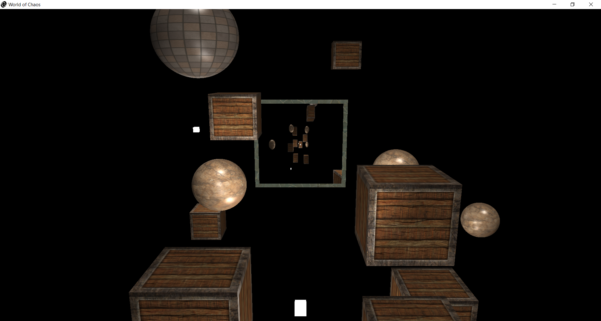
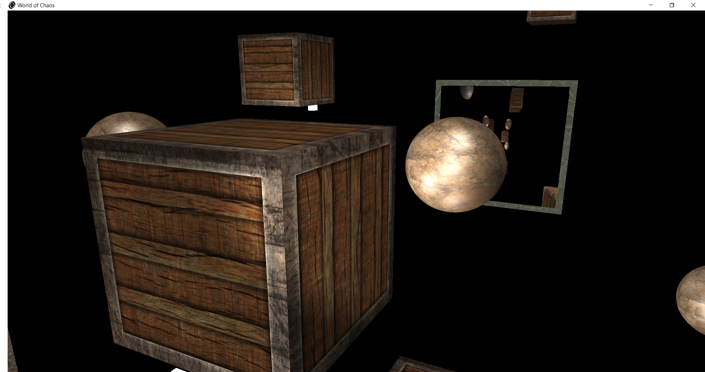

# WorldOfChaos

Dynamic 3D scene rendered using the [OpenTK](https://github.com/opentk/opentk) and [StbImageSharp](https://github.com/StbSharp/StbImageSharp) libraries.

The project showcases a 3D environment with a variety of objects, lighting effects, and advanced rendering techniques.
Designed as an interactive visualization, it offers multiple viewing perspectives and customizable rendering settings.

The project was implemented as a part of the Computer Graphics course at Warsaw University of Technology during the winter semester of the 2024-2025 academic year.

  

  

## Features

- **Objects in the Scene**:
  - **Static Objects**: Fixed in position, providing a foundation for the environment.
  - **Moving Objects**: Objects that move along predefined paths.
  - **Rotating Objects**: Objects rotating around specific axes for added dynamism.
- **Camera Types**:
  - **Static Camera**: A fixed position and angle providing an overall view of the scene.
  - **Fly-By Camera**: Allows free movement, zooming and rotating around the environment.
  - **Target-Following Camera**: A stationary camera that follows the movement of a specific object.
  - **Third-Person Camera**: Moves with a target object while maintaining a fixed offset.
- **Lighting**:
  - Implemented using the **Phong Lighting Model**.
  - Adjustable specular component, allowing switching between **Phong** and **Blinn** techniques.
  - **Light Types**:
    - **Directional Lights**: Mimic sunlight with parallel rays.
    - **Point Lights**: Emit light radially from a single point.
    - **Flash Lights**: Focused beams of light with adjustable angles.
- **Day/Night Mode**:
  - Toggle between day and night lighting scenarios for varied ambiance.
- **Fog Effect**:
  - Optional fog rendering for atmospheric depth and visual effects.
- **Mirroring with Render-to-Texture**:
  - A rectangular mirror placed in the scene reflects nearby objects.
  - Utilizes render-to-texture techniques for realistic reflections.

  

  

  

## Technologies Used

- [OpenTk](https://github.com/opentk/opentk): A powerful library for OpenGL-based rendering in .NET.
- [StbImageSharp](https://github.com/StbSharp/StbImageSharp): For texture loading and management.

## Controls

- Switching Cameras: `Space`.
- Camera Movement:
  - Fly-By Camera:
    - `W/A/S/D`: Move forward/left/backward/right.
    - `Q/E`: Move up/down.
    - `Mouse`: Zoom and rotate.
  - Third-Person Camera:
    - `Mouse`: Zoom and rotate around the moving object.
  - Target-Following Camera:
    - `Mouse`: Zoom the moving object.
- Toggle Features:
  - `N`: Day/night Mode.
  - `F`: Enable/disable fog.
  - `B`: Change lighting model (Phong/Blinn).
- Closing Window: `Esc`.

## Code Attribution

A significant portion of the code used in the `WorldOfChaos.Core` was derived from the repository [OpenTK-ImGui-Template](https://github.com/tomasz-herman/OpenTK-ImGui-Template).
It served as a great foundation for handling OpenGL abstractions.
